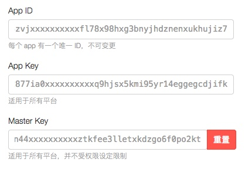
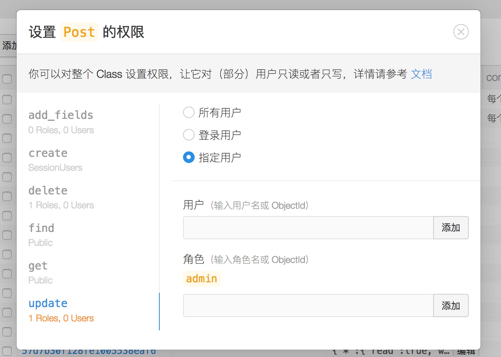
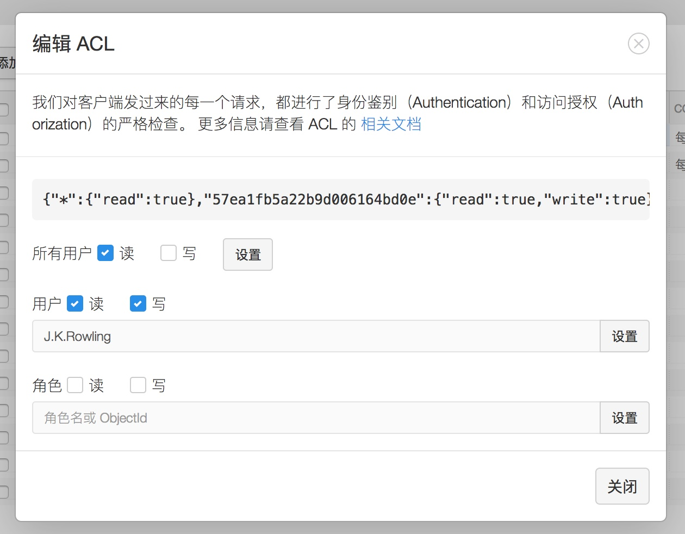

<!-- $theme: gaia -->
<!-- page_number: true -->

# ==LeanCloud== 与数据安全

#### asaka @ LeanCloud

-----

<!-- *template: invert -->

# 应用 Key 与安全性



-----

`App ID`:

- 用来标识应用
- 与安全性无关，可任意暴露

`App Key`:

- 校验请求权限，遵守应用的权限设置
- 需要暴露给客户端（iOS / Android / 浏览器）

`Master Key`:

- 校验请求权限，拥有最高权限，==不遵守==应用的权限设置
- 任何情况都==不能==暴露

-----

# `App Key 不是安全性的保障`

- 反编译
- 抓 HTTP 协议包
- 查看页面源码


❗️ **开发过程中，应假定 App Key 已经泄露，再去考虑制定安全性措施。**

-----

# ==Holy Grail：== 数据权限控制
## a.k.a ==ACL==


-----

## `传统后端应用`：

每个 URL，对于不同访问者，有不同访问权限

- `优点`：
  - 灵活性强（比如同一条数据，不同的 URL 上可以有不同权限）
- `缺点`：
  - 需要在每个 URL 对应的代码中都插入对应逻辑
  - 繁琐，容易遗漏

-----

## `LeanCloud`：

每个存储对象，对于不同访问者，有不同访问权限

- `优点`：
  - 设置好权限之后，代码中不需要再进行处理
  - 安全性高，不容易遗漏

- `缺点`：
  - 产品做出改动之后，需要修改现有数据的权限设置

-----

# `权限拥有者`

- `用户`：
  - 对应 `_User` 对象，针对单一用户做具体权限控制
- `角色`：
  - 对应 `_Role` 对象，针对一系列用户做权限控制
- `登录用户`：
  - 对应当前已登录用户
- `所有人`：
  - 对应所有访问者

-----

# `权限被控者`

- `class 级别权限`：
  - 控制整个 class 所有对象的增删改查权限，以及新增数据权限
- `object 级别权限`：
  - 控制单个对象权限

-----

### `class 权限设置`

- 需要在控制台设置

-----

### `class 权限设置页面`



-----

### `object 权限设置`

- 可以在控制台设置
- 可以创建 `object` 之后，使用代码设置／修改

-----

### `object 权限设置页面`



-----

### `使用代码设置 object 权限（ACL）`

```js
// 新建一个帖子对象
var Post = AV.Object.extend('Post');
var post = new Post();
post.set('title', 'Harry Potter & The Half Blood Prince');

// 新建一个 ACL 实例
var acl = new AV.ACL();
acl.setPublicReadAccess(true);
acl.setWriteAccess(AV.User.current(),true);

// 将 ACL 实例赋予 Post 对象
post.setACL(acl);
post.save().then(function() {
  // 保存成功
}).catch(function(err) {
  console.log(err);
});
```

-----

# 更加复杂的权限控制？

- 发帖后三十分钟内可以修改正文，之后不再允许修改
- 不允许发帖人黑名单中的用户回贴
- ……

-----

# 使用==云引擎==解决


